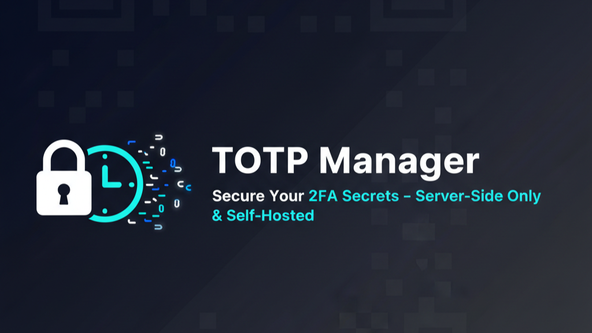

# TOTP Secret Manager



A secure, self-hosted web application for storing and managing your Time-based One-Time Password (TOTP) secrets, like those used for two-factor authentication (2FA).

This application is built with a security-first approach: your sensitive TOTP secrets are **never** sent to the client-side. All OTP code generation happens on the server. The entire application is protected by a single, self-defined password and includes brute-force protection to prevent unauthorized access.


## Key Features

-   🔐 **Server-Side Security**: TOTP secrets are stored securely in your MongoDB and are never exposed to the browser.
-   🔑 **Password Protected**: The entire application is locked behind a single master password.
-   🛡️ **Brute-Force Protection**: Automatically locks out an IP address after multiple failed login attempts.
-   📷 **QR Code Support**: Add new secrets easily by `scaning` or `uploading` or `pasting` a QR code image from your clipboard.
-   ✨ **Temporary Code Generator**: Quickly generate a one-time code from a secret key without saving it to the database.
-   ✍️ **Notes Management**: Add, edit, and delete notes for each of your secrets with a simple inline editor.
-   🖱️ **One-Click Copy**: Generate and copy TOTP codes to your clipboard with a single click.
-   🎨 **Theme Support**: Includes automatic Light/Dark mode based on your system preference, with a manual theme toggler.
-   📱 **Responsive Design**: Clean and modern UI that works seamlessly on both desktop and mobile devices.

## Tech Stack

-   **Framework**: [Next.js](https://nextjs.org/) (App Router)
-   **Styling**: [Tailwind CSS](https://tailwindcss.com/)
-   **UI Components**: [shadcn/ui](https://ui.shadcn.com/)
-   **Database**: [MongoDB](https://www.mongodb.com/)
-   **Libraries**:
    -   `next-themes` for theme management
    -   `sonner` for beautiful toast notifications
    -   `lucide-react` for icons
    -   `jsqr` for client-side QR code scanning
    -   `otpauth` for server-side TOTP generation

## Getting Started

Follow these steps to set up and run the project locally.

### 1. Prerequisites

-   [Node.js](https://nodejs.org/) (v18 or later recommended)
-   A [MongoDB](https://www.mongodb.com/try/download/community) instance (you can use a local server or a free Atlas cluster).

### 2. Installation

1.  **Clone the repository:**
    ```bash
    git clone https://github.com/nextsaimon/totp-manager.git
    cd totp-manager
    ```

2.  **Install dependencies:**
    ```bash
    npm install
    ```

### 3. Environment Variables

Create a file named `.env.local` in the root of your project. Copy the contents of `.env.example` (if you have one) or use the template below.

```env
MONGODB_URI=
DATABASE_NAME=
APP_PASSWORD=
COLLECTION_NAME=

# Brute-Force Protection Settings
MAX_LOGIN_ATTEMPTS=5
LOGIN_LOCKOUT_MINUTES=15
```

### 4. Run the Development Server

Start the application in development mode.
```bash
npm run dev
```
Open [http://localhost:3000](http://localhost:3000) in your browser to see the application.

## API Endpoints

The application uses a set of secure API endpoints that require an `X-App-Password` header for authentication on every request.

-   `GET /api/totp`
    -   Verifies the master password and returns a list of all secrets **without** their secret keys.
    -   Includes rate-limiting logic to prevent brute-force login attacks.
-   `POST /api/totp/generate`
    -   Accepts a secret's `_id` and securely generates the current TOTP code on the server, returning only the 6-digit token.
-   `POST /api/totp`
    -   Adds a new secret to the database from a provided `otpauth://` URL.
-   `PUT /api/totp`
    -   Updates the note associated with a specific secret.
-   `DELETE /api/totp`
    -   Deletes a secret from the database.

## Security Considerations

-   **Secret Isolation**: The core security principle of this application is that TOTP secrets are never transmitted to the client. The `GET /api/totp` endpoint explicitly strips this sensitive data before responding.
-   **HTTPS is Essential**: For any production deployment (e.g., on Vercel or Netlify), you **must** use HTTPS. This encrypts all traffic between the client and server, protecting your master password during login and all subsequent API calls. Modern hosting platforms typically provide this by default.
-   **Master Password**: Your application's security is only as strong as your `APP_PASSWORD`. Use a strong, unique password.
-   **Rate Limiting**: The built-in brute-force protection helps mitigate online password guessing attacks by temporarily blocking IPs with too many failed login attempts.

## Deployment

The easiest way to deploy this application is on a platform like [Vercel](https://vercel.com/) or [Netlify](https://www.netlify.com/).

1.  Push your code to a GitHub repository.
2.  Import the repository into your Vercel/Netlify account. You can host mongodb from vercel.
3.  Add the same environment variables (`MONGODB_URI`, `APP_PASSWORD`, etc.) in the project settings on the hosting platform.
4.  Deploy! The platform will handle the build process and provide you with a live, HTTPS-enabled URL.

## License

This project is licensed under the MIT License - see the [LICENSE](LICENSE) file for details.